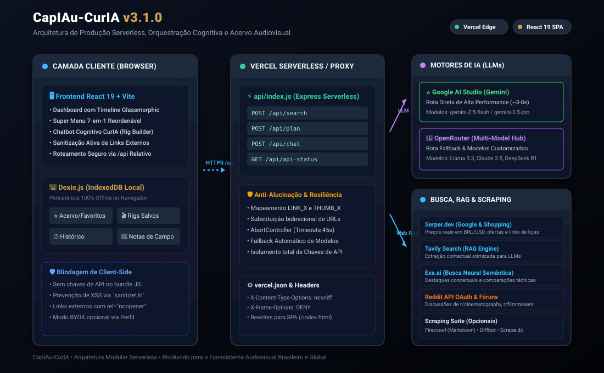

<div align="center">

# CapIAu-CurIA 🎬🔍

**Central Inteligente de Curadoria Técnica, Engenharia Financeira e Dossiê de Equipamentos Audiovisuais**

[](https://react.dev/)
[](https://www.typescriptlang.org/)
[](https://vite.dev/)
[](https://vercel.com/)
[](https://dexie.org/)
[](https://github.com/fernangcortes/CapIAu-CurIA)
[](LICENSE)

<br/>

<p align="center">
  
</p>

</div>

---

## 📑 Índice

1. [Visão Geral e Filosofia](#-1-visão-geral-e-filosofia)
2. [Principais Funcionalidades](#-2-principais-funcionalidades)
   - 2.1 [Planejador Cognitivo & Construtor de Rigs](#21-planejador-cognitivo--construtor-interativo-de-rigs)
   - 2.2 [Super Menu 7-em-1 Modular](#22-super-menu-7-em-1-modular-e-reordenável)
   - 2.3 [Sidebar Retrátil 4-em-1](#23-sidebar-retrátil-4-em-1)
   - 2.4 [Persistência Local Offline-First (Dexie.js)](#24-persistência-local-offline-first-dexiejs)
   - 2.5 [Blindagem Anti-Alucinação de URLs](#25-blindagem-anti-alucinação-de-urls)
3. [Arquitetura do Sistema](#️-3-arquitetura-do-sistema)
4. [Matriz de APIs e Provedores Suportados](#-4-matriz-de-apis-e-provedores-suportados)
5. [Como Executar Localmente](#-5-como-executar-localmente)
6. [Deploy em Produção na Vercel](#-6-deploy-em-produção-na-vercel)
7. [Estrutura de Pastas e Arquivos](#-7-estrutura-de-pastas-e-arquivos)
8. [Segurança e Boas Práticas](#-8-segurança-e-boas-práticas)
9. [Documentação Complementar](#-9-documentação-complementar)
10. [Contribuição e Changelog](#-10-contribuição-e-changelog)
11. [Licença](#-11-licença)

---

## 💡 1. Visão Geral e Filosofia

O **CapIAu-CurIA** é uma plataforma de inteligência técnica e engenharia financeira voltada para profissionais, produtoras e técnicos da indústria audiovisual. 

Comprar ou alugar equipamentos de cinema, vídeo e fotografia é um processo de alta complexidade: envolve dezenas de compatibilidades mecânicas (bocais de lentes, alimentação, rigs), cálculo de tempo de retorno financeiro (*Break-Even*), histórico de bugs conhecidos de lote e ofertas dispersas em dezenas de lojas e fóruns especializados.

### Princípios de Design:
* **Zero Dados Sintéticos / 100% Realidade:** Não há dados fictícios simulados. Toda especificação e preço provém de consultas reais em APIs de busca e e-commerce em tempo real.
* **Pensar Antes de Buscar:** O sistema não apenas pesquisa termos simples; ele interpreta intenções conceituais de produção e monta planos de setups de equipamentos.
* **Privacidade e Offline-First:** Histórico, anotações de campo, favoritos e configurações ficam no navegador do usuário via IndexedDB, sem exigir cadastro ou login externo.
* **Desempenho Serverless:** Arquitetura adaptada para rodar com latência mínima em CDN e Serverless Functions globais na Vercel.

---

## 🚀 2. Principais Funcionalidades

### 2.1 Planejador Cognitivo & Construtor Interativo de Rigs
* **Interpretação Semântica de Necessidades:** Ao buscar um objetivo como *"kit para podcast de 2 pessoas"* ou *"setup leve de iluminação externa"*, o sistema ativa o modo cognitivo:
  1. Decompõe a necessidade nas categorias essenciais (Câmera, Lentes, Áudio, Iluminação, Suporte).
  2. Sugere equipamentos reais de alta compatibilidade e custo-benefício.
  3. Estipula orçamentos individuais estimados em dólares e o objetivo global do setup.
* **Timeline Glassmorphic com Progresso:** Uma barra de status translúcida exibe o progresso em tempo real de cada pesquisa sequencial de hardware, com espaçamento inteligente para respeitar os limites de taxa de requisição (*Rate Limits*).
* **Edição de Rig no Chat:** No assistente de chat **CurIA**, o usuário pode renomear itens, redefinir valores de orçamento, remover ou adicionar novos equipamentos antes de consolidar o setup no banco de dados local.

### 2.2 Super Menu 7-em-1 Modular e Reordenável
Ao selecionar qualquer equipamento da lista de resultados ou do acervo, um painel em overlay é acionado contendo 7 módulos informativos independentes que podem ser reordenados, ocultados ou fixados:
1. **Ficha Técnica (Specs Grid):** Especificações cruciais mapeadas (Montagem, Sensor, Resolução, Conexões, Alimentação, Peso).
2. **Preços e Lojas em Tempo Real:** Tabela comparativa de ofertas com selos automáticos de *Melhor Custo-Benefício* e *Menor Risco* (lojas oficiais), garantia e frete.
3. **Ciclo de Vida & Engenharia Financeira:** 
   * Dias de locação para retorno do investimento (*Break-Even Days*).
   * Valor residual e depreciação projetada após 1 ano e 3 anos de uso.
   * Custo diário operacional estimado.
4. **Dossiê Analítico de IA:** Resumo crítico, nota técnica (*Score*), prós objetivos, limitações, cenários ideais e cenários a evitar.
5. **Gears Similares & Comparativo Direto:** Matriz lado a lado com duas alternativas concorrentes de mercado da mesma categoria.
6. **Manuais Técnicos & Tutoriais Oficiais:** Links diretos e validados para manuais em PDF e vídeos explicativos.
7. **Notas de Campo (Field Notes):** Editor de texto para anotações do próprio operador sobre testes práticos, problemas em set e compatibilidades.

### 2.3 Sidebar Retrátil 4-em-1
* **Filtros Flexíveis:** Refinamento por Categoria dinâmica, Fabricante/Marca, Bocal de Lente, Resolução Máxima, Limite de Preço e Especificações Mínimas (*Min Specs*).
* **Histórico Cognitivo:** Acesso rápido às últimas 30 consultas realizadas na sessão.
* **Acervo Local:** Coleção de equipamentos favoritos com sistema de classificação por estrelas (1 a 5).
* **Perfil do Produtor:** Configurações de chaves de API com status em tempo real das variáveis configuradas no servidor/Vercel.

### 2.4 Persistência Local Offline-First (Dexie.js)
Toda a memória do usuário é gerenciada via **Dexie.js** sobre a API nativa IndexedDB do navegador:
* `favorites`: Equipamentos favoritados com notas e estrelas.
* `rigs`: Setups de produção agrupando múltiplos itens.
* `searchHistory`: Consultas anteriores e metadados.
* `notes`: Anotações de campo particulares por equipamento.

### 2.5 Blindagem Anti-Alucinação de URLs
Os modelos de linguagem frequentemente "inventam" links de compra quebrados quando instruídos a retornar links de lojas. O CapIAu-CurIA resolve isso na raiz:
1. Antes de enviar o contexto ao LLM, todas as URLs e miniaturas reais capturadas nas buscas são substituídas por marcadores atômicos (`LINK_1`, `THUMB_1`).
2. O LLM é instruído com penalização severa a utilizar estritamente os marcadores.
3. O backend intercepta o JSON gerado e restaura as URLs originais e seguras.
4. Todos os links na interface passam por sanitização via `sanitizeUrl`, garantindo que apenas esquemas `http://` e `https://` sejam renderizados com proteção `rel="noopener noreferrer"`.

---

## 🏗️ 3. Arquitetura do Sistema

```
┌─────────────────────────────────────────────────────────────┐
│                 NAVEGADOR / CLIENTE (SPA)                   │
│  React 19 + TypeScript + Vite + Glassmorphic UI             │
│  Dexie.js (IndexedDB Local) ── Cache de Consultas (24h)     │
└──────────────────────────────┬──────────────────────────────┘
                               │  Chamadas HTTPS (/api/*)
                               ▼
┌─────────────────────────────────────────────────────────────┐
│              VERCEL SERVERLESS / PROXY LOCAL                │
│  api/index.js (Express Serverless Handler)                  │
│  • Tokenização Anti-Alucinação (LINK_X / THUMB_X)           │
│  • Timeouts Estruturados via AbortController (45s)          │
│  • Cabeçalhos de Segurança (CSP, nosniff, DENY)             │
└───────────────┬─────────────────────────────┬───────────────┘
                │                             │
       Chamadas de LLM               Buscas na Web / RAG
                ▼                             ▼
┌───────────────────────────────┐ ┌───────────────────────────┐
│       MOTORES DE IA           │ │   BUSCA, RAG & SCRAPING   │
│ • Google AI Studio (Gemini)   │ │ • Serper.dev (Google/Shop)│
│   (Rota Direta, ~3-8s)        │ │ • Tavily API (RAG Técnico)│
│ • OpenRouter (Multi-Modelos)  │ │ • Exa.ai (Busca Neural)   │
│   (Fallback para Llama/Claude)│ │ • Reddit API (Comunidades)│
│                               │ │ • Firecrawl / Diffbot     │
└───────────────────────────────┘ └───────────────────────────┘
```

---

## 🔌 4. Matriz de APIs e Provedores Suportados

Para o detalhamento completo de cada serviço, limites de requisições e links oficiais de geração de chaves, consulte o arquivo [docs/referencia-provedores-api.md](docs/referencia-provedores-api.md).

| Provedor | Tipo | Utilidade no CapIAu-CurIA | Custo / Free Tier |
| :--- | :--- | :--- | :--- |
| **Google AI Studio** | LLM | Síntese do Dossiê, Rigs e Chatbot CurIA | Grátis (15 RPM) |
| **OpenRouter** | LLM | Fallback de contingência e modelos alternativos | Modelos `:free` e PAYG |
| **Serper.dev** | Web Search | Preços reais de lojas brasileiras e Google Shopping | 2.500 buscas grátis |
| **Tavily** | RAG Search | Extração técnica limpa e precisa para contexto | 1.000 buscas/mês grátis |
| **Exa.ai** | Neural Search | Destaques semânticos e comparações conceituais | Trial gratuito |
| **Reddit API** | Fóruns | Captura de discussões reais em fóruns de cinema | Grátis (OAuth) |
| **Firecrawl** | Web Scraper | Extração de páginas de specs convertidas para Markdown | 1.000 páginas/mês grátis |
| **Diffbot** | Web Extractor | Parsing estruturado de reviews técnicos em JSON | 10.000 páginas/mês grátis |
| **Scrape.do** | Proxy Scraper | Fallback de extração anti-bloqueio para e-commerce | 1.000 requisições grátis |

---

## 💻 5. Como Executar Localmente

### Pré-requisitos
* Node.js v18.0.0 ou superior instalado.
* NPM ou gerenciador de pacotes equivalente.

### 1. Clonar o Repositório e Instalar Dependências
```bash
git clone https://github.com/fernangcortes/CapIAu-CurIA.git
cd CapIAu-CurIA
npm install
```

### 2. Configurar o Arquivo de Ambiente
Copie o modelo de exemplo para `.env`:
```bash
cp .env.example .env
```
Abra o arquivo `.env` e preencha com as suas chaves (pelo menos `GEMINI_API_KEY` e `SERPER_API_KEY` são recomendadas para uma experiência completa).

### 3. Iniciar o Ambiente de Desenvolvimento
Em dois terminais separados (ou usando sua ferramenta de processos preferida):

**Terminal 1 — Iniciar o Servidor Proxy:**
```bash
node server.js
```
*O proxy iniciará em `http://localhost:5000`.*

**Terminal 2 — Iniciar o Frontend Vite:**
```bash
npm run dev
```
*O aplicativo abrirá em `http://localhost:5173`. O Vite encaminhará automaticamente todas as chamadas `/api` para a porta 5000.*

---

## 🚀 6. Deploy em Produção na Vercel

O CapIAu-CurIA já está 100% configurado para a Vercel através de Serverless Functions (`api/index.js`) e do arquivo [`vercel.json`](vercel.json).

### Passo a Passo de Publicação:

1. **Envie o código para o seu repositório no GitHub:**
   ```bash
   git add .
   git commit -m "feat: release inicial CapIAu-CurIA v3.1.0"
   git push origin main
   ```

2. **Importar o Projeto na Vercel:**
   * Acesse [vercel.com](https://vercel.com) e conecte sua conta do GitHub.
   * Clique em **Add New... ➔ Project** e selecione o repositório **CapIAu-CurIA**.
   * O framework **Vite** e a pasta de saída `dist` serão detectados automaticamente.

3. **Cadastrar as Variáveis de Ambiente:**
   Na seção **Environment Variables**, cadastre as chaves necessárias (veja [`.env.example`](.env.example)):
   * `GEMINI_API_KEY`
   * `OPENROUTER_API_KEY`
   * `SERPER_API_KEY`
   * `TAVILY_API_KEY`
   * `EXA_API_KEY`
   * *(e demais chaves opcionais)*

4. **Deploy:**
   * Clique em **Deploy**.
   * Em menos de 1 minuto, sua aplicação estará ativa em `https://seu-projeto.vercel.app` com HTTPS, cache de CDN global e endpoints serverless operando.

---

## 📁 7. Estrutura de Pastas e Arquivos
 
```
CapIAu-CurIA/
├── api/
│   └── index.js                 # Handler Express para Vercel Serverless Functions
├── docs/
│   ├── api_documentation.md     # Documentação dos contratos de endpoints
│   ├── architecture_guidelines.md # Diretrizes de arquitetura de código
│   ├── capiau_curia_arquitetura_v3.1.md # Especificação técnica profunda da v3.1
│   └── referencia-provedores-api.md # Guia oficial de links e obtenção de chaves
├── public/
│   ├── architecture.svg         # Diagrama visual de arquitetura do sistema
│   ├── favicon.svg              # Favicon oficial
│   └── icons.svg                # Ícones da interface
├── src/
│   ├── components/
│   │   ├── ChatAssistant.tsx    # Assistente cognitivo CurIA com Rig Builder
│   │   ├── Dashboard.tsx        # Tela principal, busca e timeline glassmorphic
│   │   ├── Sidebar.tsx          # Menu retrátil 4-em-1 (Filtros, Histórico, Acervo, Perfil)
│   │   └── SuperMenu.tsx        # Overlay 7-em-1 modular reordenável do equipamento
│   ├── db/
│   │   └── localDatabase.ts     # Esquema de banco de dados Dexie.js (IndexedDB)
│   ├── services/
│   │   └── apiRouter.ts         # Roteador unificado de chamadas para APIs e proxy
│   ├── App.css                  # Estilos globais da aplicação
│   ├── index.css                # Variáveis CSS e tema glassmorphic escuro
│   └── main.tsx                 # Ponto de entrada do React 19
├── .env.example                 # Modelo de variáveis de ambiente para deploy
├── .gitignore                   # Regras de exclusão com blindagem de credenciais
├── CHANGELOG.md                 # Histórico cronológico de versões
├── CONTRIBUTING.md              # Guia para contribuidores humanos e agentes de IA
├── package.json                 # Manifesto de dependências e scripts do projeto
├── server.js                    # Servidor Express para desenvolvimento local
├── vercel.json                  # Roteamento e cabeçalhos de segurança da Vercel
└── vite.config.ts               # Configuração do Vite com proxy reverso local
```

---

## 🔐 8. Segurança e Boas Práticas

* **Isolamento de Credenciais:** As chaves de API do proprietário da aplicação nunca são incorporadas no código estático do cliente; residem com segurança nas variáveis de ambiente do backend/Vercel.
* **Prevenção contra XSS em Links:** A função `sanitizeUrl` garante que links externos gerados pela IA só possam ser abertos caso utilizem protocolos seguros (`http://` ou `https://`), anulando ataques de execução de script via `javascript:`.
* **Zero Vulnerabilidades em Dependências:** O repositório é periodicamente auditado via `npm audit` mantendo 0 vulnerabilidades de pacotes.
* **Cabeçalhos de Proteção HTTP:** O `vercel.json` inclui cabeçalhos restritivos como `nosniff`, `DENY` contra ataques de Clickjacking (iframes) e controle estrito de `Referrer-Policy`.

---

## 📖 9. Documentação Complementar

* [Guia de Referência de Provedores de API](docs/referencia-provedores-api.md): Links oficiais de documentação, consoles de desenvolvedor e cotas de cada serviço.
* [Especificação Arquitetural v3.1](docs/capiau_curia_arquitetura_v3.1.md): Detalhamento dos fluxos de dados, heurísticas de seleção de hardware e modelagem conceitual.
* [Documentação de Contratos de API](docs/api_documentation.md): Tipagens de entrada e saída dos endpoints `/search`, `/plan` e `/chat`.
* [Diretrizes de Arquitetura de Código](docs/architecture_guidelines.md): Padrões de código adotados no projeto.

---

## 🤝 10. Contribuição e Changelog

Contribuições de desenvolvedores e agentes de IA são muito bem-vindas!
* Leia o nosso [Guia de Contribuição](CONTRIBUTING.md) para conhecer as regras de commit e padrões de desenvolvimento.
* Acompanhe todas as atualizações de versões no [CHANGELOG.md](CHANGELOG.md).

---

## 📜 11. Licença

Este projeto é distribuído sob a licença **MIT**. Consulte o arquivo de licença para obter mais informações.

---

<div align="center">
  <sub>Desenvolvido com foco no ecossistema audiovisual profissional e independente. 🎥✨</sub>
</div>
