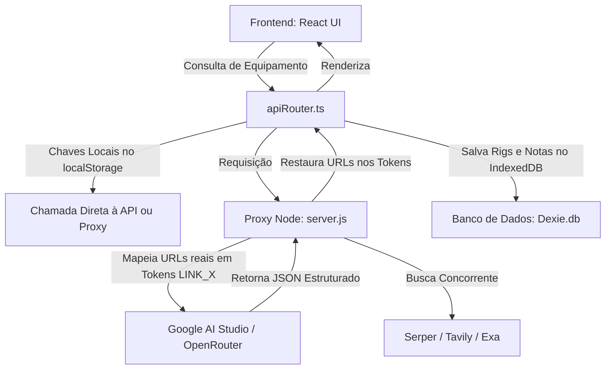

# Diretrizes do Sistema: Stack, Arquitetura e Padrões de Resposta

Este documento define os padrões técnicos, regras arquiteturais e diretrizes de resposta estruturada adotadas no ecossistema **CapIAu-CurIA**.

---

## 🛠️ 1. Stack Tecnológica

O projeto é dividido em um frontend SPA de alto desempenho e um servidor de proxy local leve:

### Frontend (SPA)
*   **Core**: [React 19](https://react.dev/) + [TypeScript 5.x](https://www.typescriptlang.org/) + [Vite 8.x](https://vite.dev/)
*   **Estilização**: Vanilla CSS puro com Custom Properties (Variáveis CSS) para temas e responsividade (evitando Tailwind CSS para controle fino e carregamento instantâneo).
*   **Ícones**: [Lucide React](https://lucide.dev/)
*   **Persistência**: [Dexie.js](https://dexie.org/) (camada de abstração otimizada para IndexedDB no navegador).

### Backend (Proxy Local)
*   **Core**: [Node.js](https://nodejs.org/) (ES Modules)
*   **Servidor**: [Express 5.x](https://expressjs.com/) (com suporte a CORS e JSON parsing).
*   **Requisições**: Native Fetch API do Node com controle de cancelamento ativo por `AbortController`.

### Inteligência Artificial & Motores de Busca
*   **Provedores de IA**: API nativa do **Google AI Studio** (modelo principal: `google/gemini-2.5-flash`) com chave direta, e **OpenRouter.ai** como barramento de fallback automático.
*   **Motores de Busca**: **Serper.dev** (Google Shopping e busca orgânica rápida), **Tavily API** (RAG e análises profundas), e **Exa.ai** (busca neural semântica).

---

## 🏛️ 2. Regras de Arquitetura

Para manter a resiliência e integridade do ecossistema, os seguintes princípios arquiteturais devem ser mantidos em qualquer alteração:



### A. Fluxo de Dados Desacoplado e Resiliente
*   **Chaves de API**: As chaves são informadas no frontend e salvas no `localStorage`. Elas são passadas em cada requisição para o proxy local (`server.js`) no header da requisição, garantindo segurança contra vazamento em commits.
*   **Fallbacks Concorrentes**: Caso uma API de pesquisa (ex: Serper) falhe, o sistema deve isolar a exceção e tentar consolidar as especificações a partir das respostas bem-sucedidas das demais APIs (Tavily/Exa).
*   **Fallback de LLM**: Se a rota direta do Google AI Studio sofrer timeout ou instabilidade (HTTP 503), o backend deve tentar imediatamente a rota do OpenRouter.

### B. Ciclo de Vida e Limites de Tempo (Timeouts)
*   Nenhuma chamada de chat ou consolidação de equipamentos pode rodar indefinidamente.
*   **Limites de Execução**:
    *   Timeout máximo do proxy backend: **45 segundos**.
    *   Timeout máximo do frontend para o chat: **35 segundos**.
*   Toda chamada assíncrona deve aceitar um sinal de cancelamento (`AbortController.signal`) para interromper a execução assim que o tempo limite for excedido.

### C. Pipeline Anti-Alucinação de Links e Imagens
*   Os LLMs tendem a alucinar URLs técnicas e imagens que não existem ou a apontar para o próprio `localhost`.
*   **Regra de Substituição (Tokenization)**:
    1. O proxy/serviço intercepta os links reais coletados pelos motores de busca.
    2. Substitui os links e miniaturas por IDs temporários (`LINK_0`, `THUMB_0`).
    3. Envia o texto/JSON para o LLM.
    4. Ao receber a resposta processada pelo LLM, substitui os tokens de volta pelas URLs originais e válidas capturadas na etapa de busca física.

### D. Zero Simulação Procedural (Sem Dados Fake)
*   **Dados 100% Reais**: Não é permitida a criação ou persistência de mocks proceduralmente gerados por IA para contornar falhas de busca. Se as buscas falharem, o sistema deve apresentar um erro técnico claro e real de conexão ao usuário.

---

## 📋 3. Padrões de Resposta

Os dados e as respostas gerados pelo sistema devem seguir regras estritas de formatação e tipagem:

### A. Tipagem JSON das Fichas Técnicas (Interface `EquipmentData`)
Toda ficha de equipamento extraída da internet e consolidada pela IA deve corresponder exatamente ao seguinte esquema TypeScript:

```typescript
export interface EquipmentData {
  id: string;
  name: string;
  manufacturer: string;
  category: string;
  specs: Record<string, string>; // Especificações técnicas reais
  prices: {
    store: string;
    price: string;
    condition: string;
    shipping: string;
    warranty: string;
    totalPrice: string;
    isBestDeal: boolean;
    isLowRisk: boolean;
    link: string; // URL Real pós-tokenização
    thumbnail: string;
  }[];
  dossier: {
    summary: string;
    pros: string[];
    cons: string[];
    recommendationScore: number; // 0 a 100
    bestFor: string[];
    avoidFor: string[];
  };
  similars: {
    manufacturer: string;
    name: string;
    difference: string; // Explicação técnica da diferença
    priceRatio: string; // ex: "20% mais barato", "Mesmo preço"
  }[];
  manuals: {
    title: string;
    url: string; // URL Real oficial
    type: string; // ex: "Manual Oficial PDF", "Vídeo Guia"
  }[];
  maintenance: {
    currentFirmware: string;
    releaseDate: string;
    recentIssues: string[];
    troubleshoot: { problem: string; solution: string; }[];
  };
  financials: {
    breakEvenDays: number;
    residualValue1Yr: string;
    residualValue3Yr: string;
    estimatedDailyCost: string;
  };
  comparisons: {
    field: string;
    current: string;
    competitor1: string; // Modelo físico real equivalente de marca concorrente
    competitor2: string;
  }[];
}
```

### B. Formatação de Respostas do Chat (Assistente Técnico)
*   **Idioma**: Português brasileiro claro, técnico e conciso.
*   **Estrutura de Markdown**: Uso de tabelas para listagem de preços e especificações, tópicos claros com emojis temáticos para prós e contras, e blocos de alerta (Markdown Alerts) para avisos cruciais de compatibilidade.
*   **Comportamento de Links**: Todo link sugerido pelo chat para manuais ou compras deve ser formatado em Markdown padrão, usando as URLs válidas extraídas pelas buscas em tempo real.
